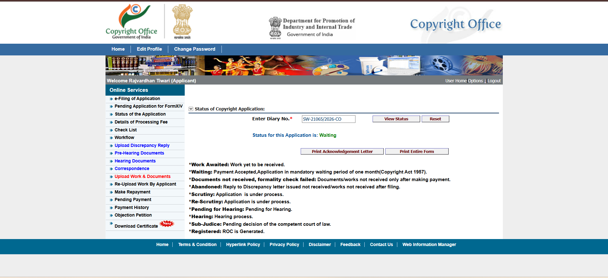
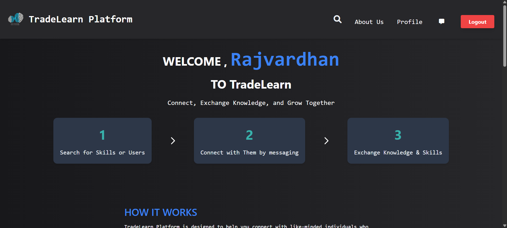

# Submission Details

| Field | Details |
|-------|---------|
| **Names with Roll Numbers** | Rajvardhan (2210990710) |
| **Project Title** | Smart Study Planner |
| **Project Type** | Copyright |
| **Team Details** | Rajvardhan (2210990710) |
| **Submission Status** | Waiting |




# TradeLearn - Learn Skills, Build Real Value



TradeLearn is a full-stack peer-to-peer skill exchange web app where users teach skills, learn from others, and collaborate through a structured platform.

## Overview

TradeLearn helps users grow together through a simple skill-exchange flow:

- 🔍 Discover people by skill and interest
- 💬 Connect through direct messaging
- 🤝 Exchange knowledge in both directions
- 🌱 Learn faster with peer-to-peer collaboration
- 👤 Manage your profile, activity, and progress

### Why TradeLearn?

- 💸 No costly subscription model for learning
- 🧠 Knowledge becomes the real currency
- 🌍 Community-first learning experience
- 🚀 Built for practical, real-world skill growth


## Tech Stack

- Frontend: `EJS`, `HTML`, `CSS`, vanilla `JavaScript`
- Backend: `Node.js`, `Express.js`
- Database: `MongoDB`, `Mongoose`
- Auth/Security: `JWT`, `bcrypt`, `cookie-parser`, `express-session`
- Other: `multer` (profile image upload), `nodemailer` (OTP), `dotenv`

## Folder Structure

```text
TradeLearn/
|-- README.md
`-- Source_Code/
    |-- app.js
    |-- package.json
    |-- .env
    |-- models/
    |-- routes/
    |-- views/
    |-- public/
    |-- storage.js
    `-- transporter.js
```

## Prerequisites

- Node.js (v18+ recommended)
- npm
- MongoDB Local or MongoDB Atlas

## Setup and Run

1. Move to app folder:

```bash
cd Source_Code
```

2. Install dependencies:

```bash
npm install
```

3. Configure environment file `Source_Code/.env`:

```env
MONGO_URI=mongodb://127.0.0.1:27017/tradelearn
APP_PORT=3000

SESSION_SECRET=tradelearn_session_secret_change_me
JWT_SECRET=tradelearn_jwt_secret_change_me

EMAIL_USER=your_email@example.com
EMAIL_PASS=your_app_password
```

4. Start server:

```bash
npm start
```

5. Open in browser:

`http://localhost:3000`

## Current Routes (from `app.js`)

### Public

- `GET /` -> login page
- `GET /Register` -> registration page
- `GET /aboutus` -> about page
- `POST /register` -> send registration OTP
- `POST /login` -> login with username/password
- `GET /loginOTP?email=...&name=...` -> login OTP page
- `POST /loginVerify` -> verify login OTP
- `GET /otpVerification?email=...` -> registration OTP page
- `POST /otpVerification` -> verify registration OTP and create user

### Protected (requires auth cookie)

- `GET /home` -> user home
- `GET /dashboard` -> user dashboard
- `GET /footer` -> skill search page
- `POST /footer` -> search users by skill
- `GET /PersonalMessages` -> message list
- `GET /text/:username` -> open conversation
- `POST /text/:username` -> send message
- `GET /delete/:username` -> delete conversation
- `GET /reply` -> message box page
- `GET /message` -> message page
- `GET /updateuser` -> edit profile form
- `POST /updateuser` -> update profile data
- `POST /update-profile-pic` -> upload profile image
- `POST /remove-profile-pic` -> reset profile image
- `GET /userdelete` -> delete current user
- `GET /logout` -> logout

## Scripts

From `Source_Code/package.json`:

```json
"scripts": {
  "start": "nodemon app.js"
}
```

## Main Features

- User registration with OTP verification
- Username/password login + OTP verification
- JWT cookie-based protected routes
- User profile and profile photo management
- Skill-based user discovery
- Personal messaging between users
- Dashboard and account management

## Notes

- Default app URL is `http://localhost:3000` (from `APP_PORT=3000`).
- If you run local MongoDB, `MONGO_URI` can stay `mongodb://127.0.0.1:27017/tradelearn`.
- For OTP email delivery, configure a valid sender in `transporter.js` (or migrate transporter auth to use `EMAIL_USER` and `EMAIL_PASS` from `.env`).
